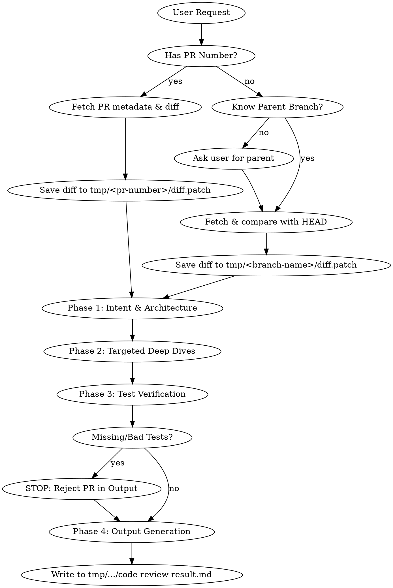

# Java Code & Pull Request Review Workflow

**EXECUTION LOGGING:** As your FIRST output, before any other text, you MUST output the following block verbatim:
> ⚙️ **Amazon Q Execution Log**
> **Domain:** Java
> **Active Skill:** java-change-review

## Overview
A systematic, multi-pass review process for Java Pull Requests and local branch changes. You MUST perform the review in strict phases, acquiring the data safely, storing it locally, and applying specific specialized lenses only when triggered.

**Core Principle:** Find critical flaws first. Nitpicks come last. Tests are non-negotiable.

## Prerequisites

**SUB-SKILL LOADING:** AmazonQ loads all prompt files from `~/.aws/amazonq/prompts/` (global) or `.amazonq/prompts/` (local) at conversation start. The sub-skills referenced below are available in your context. When a phase says to apply a sub-skill, focus your attention on those principles — you do not need to read additional files.
**FALLBACK:** If a referenced sub-skill file is not available, apply general best practices for that domain.

## When to Use

- Reviewing Java code changes in a Pull Request
- Checking a branch diff before merging
- Auditing code changes for bugs, security flaws, or missing tests
- Pre-merge review to ensure code quality

## When NOT to Use

- **Non-Java code:** Use language-specific review prompts for Python, JavaScript, etc.
- **Single file review:** Use `java:code-review.md` for focused single-file reviews
- **Documentation-only changes:** No code review needed for pure documentation PRs
- **No diff available:** Get the diff first — review requires seeing actual changes

## Review Pipeline



### Phase 0: Data Acquisition & Diff Extraction
Before reviewing any code, you MUST acquire the diff using shell commands and save it locally.
- **PHASE LOGGING:** You MUST output: `> ⚙️ **Execution Log (Phase 0):** Acquiring diff and initializing workspace`

**Scenario A: The user provides a PR Number**
1. Run `gh pr view <number> --json title,body` to understand the intent.
2. Ensure the directory `tmp/<number>` exists.
3. Run `gh pr diff <number> > tmp/<number>/diff.patch` to save the full code changes locally.
4. Review the diff from the saved file. (If the diff is massive, analyze it safely file by file).

**Scenario B: The user provides a Local Branch (No PR Number)**
1. If the user did not specify a parent branch, **STOP and ask**: "What is the parent branch to compare against? (e.g., main, develop)"
2. Get the current branch name: `git branch --show-current`.
3. Ensure the directory `tmp/<current-branch-name>` exists.
4. Run `git fetch origin <parent-branch>` safely without modifying the local working tree.
5. Run `git diff origin/<parent-branch>...HEAD > tmp/<current-branch-name>/diff.patch` to save the changes locally.
6. Review the diff from the saved file.

**STOP. VERIFY:** Have you saved the diff to a local file? If not, stop and save it now. Do not proceed without a saved diff.

**Edge Cases:**
- If the diff is empty, report 'No changes found' and stop.
- If the diff has >50 files, analyze file by file. Do NOT attempt to review the entire diff in one pass.

### Phase 1: Intent & Architecture Scan
- **PHASE LOGGING:** You MUST output: `> ⚙️ **Execution Log (Phase 1):** Analyzing intent and architecture with java:code-review.md and java:clean-code.md`
- **Goal:** Understand *what* this PR/branch does and if the design is sound based on the saved diff.
- **Action:** Read the diff. Does it solve the stated problem?
- **ALWAYS:** Apply **REQUIRED SUB-SKILL:** `java:code-review.md` (baseline standards) and **REQUIRED SUB-SKILL:** `java:clean-code.md` (clean code lens).
- **IF new classes/interfaces/refactoring (>100 lines):** Also apply **REQUIRED SUB-SKILL:** `java:solid-principles.md` and **REQUIRED SUB-SKILL:** `java:design-patterns.md`.

**STOP. VERIFY:** Did you identify the PR's intent and architectural impact? Which sub-skills (solid-principles, design-patterns, clean-code, code-review) apply based on what you found?

### Phase 2: Targeted Deep Dives
- **PHASE LOGGING:** You MUST output: `> ⚙️ **Execution Log (Phase 2):** Performing targeted deep dives (Security, Concurrency, Performance)`
Do not blindly review line-by-line. Look for specific triggers in the diff:
- **Trigger:** Endpoints, SQL/JPA queries, or user input? **REQUIRED SUB-SKILL:** `java:security-audit.md`
- **Trigger:** `@Async`, `Runnable`, `CompletableFuture`, or synchronized blocks? **REQUIRED SUB-SKILL:** `java:concurrency-review.md`
- **Trigger:** Heavy loops, nested Streams, or large data transformations? **REQUIRED SUB-SKILL:** `java:performance-smell-detection.md`

**STOP. VERIFY:** Did you check each trigger category? Which triggers were found in the diff? Which sub-skills did you apply?

### Phase 3: Test Verification (The Iron Law)
- **PHASE LOGGING:** You MUST output: `> ⚙️ **Execution Log (Phase 3):** Verifying test quality and coverage with java:test-quality.md`
- **Goal:** Verify the code proves its own correctness.
- **Action:** Review `src/test/java` changes in the diff.
- **REQUIRED SUB-SKILL:** `java:test-quality.md` — Check for JUnit 5 usage and AssertJ assertions.

**STOP. VERIFY:** Are there tests for ALL new logic and bug fixes? If any test coverage is missing, the review MUST flag this as a Critical Blocker.

## Red Flags - STOP and Reject Immediately
If you see any of the following, do not proceed to nitpicking. The code must be rejected in the final output:
- **No tests included** for new logic or bug fixes.
- **Commented-out code** or `System.out.println` left in the diff.
- **Unhandled generic exceptions** (`catch (Exception e) {}`).
- **Logic mixed in controllers** instead of delegated to services **REQUIRED SUB-SKILL:** `java:spring-boot-patterns.md`

### Phase 4: Output Generation
- **PHASE LOGGING:** You MUST output: `> ⚙️ **Execution Log (Phase 4):** Generating final review output`
You MUST save the final review result to the local filesystem. Do not just print a wall of text to the chat.
1. Determine the path based on Phase 0:
    - For PRs: `tmp/<pr-number>/code-review-result.md`
    - For Local branches: `tmp/<current-branch-name>/code-review-result.md`
2. Write the formatted review (following the Strict Output Format) to this file.
3. Print a brief summary to the user indicating where the diff and the review file were saved, along with the top-level conclusion (e.g., "Review complete: 1 Critical Blocker found.").

## Strict Output Format (For code-review-result.md)
You MUST format your final response file exactly like this.

```markdown
### 📊 PR Summary
[2-3 sentences on the overall health and intent of the PR]

### 🚨 Critical Blockers (Must Fix)
- [Only list severe bugs, security flaws, concurrency issues, or missing tests]

### ⚠️ Architecture & Design (Should Fix)
- [SOLID violations, incorrect pattern usage, performance smells]

### 🧹 Clean Code Nitpicks (Optional)
- [Variable naming, formatting, stream simplifications]
```

## Anti-Rationalization Checklist
| Excuse | Reality |
|--------|---------|
| "The PR is small, it doesn't need tests." | All logic changes require tests. Reject it. |
| "I'll just list all my findings at once." | Burying critical bugs under style nitpicks is dangerous. Use the strict output format. |
| "I'll review the tests later." | Tests are Phase 3. They are part of the review, not an afterthought. |
| "I'll just read the diff in memory." | Diff MUST be saved to the tmp directory first to maintain an audit trail and handle large files safely. |
| "It's just a minor change, review isn't needed." | Every change touches production. Minor changes cause major incidents. Full review. |
| "I'll skip security for this internal service." | Internal services handle sensitive data too. Security review is always REQUIRED. |
| "The existing tests cover it." | Existing tests don't cover NEW code. Verify test coverage for changed lines. |
| "I don't need to read the full diff." | Reading only part of the diff means missing cross-file impacts. Read the entire diff. |
