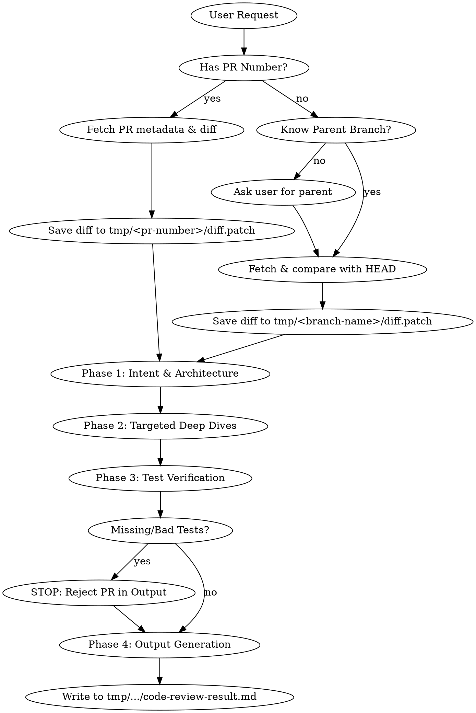

# Java Code & Pull Request Review Workflow

## Overview
A systematic, multi-pass review process for Java Pull Requests and local branch changes. You MUST perform the review in strict phases, acquiring the data safely, storing it locally, and applying specific specialized lenses only when triggered.

**Core Principle:** Find critical flaws first. Nitpicks come last. Tests are non-negotiable.

## Review Pipeline



**REQUIRED BACKGROUND:** You MUST reference `java:code-review.md` for baseline standards before beginning the actual review phases.
*Note on Prompts Location: Depending on the user's setup, the required reference prompts mentioned below (e.g., `java:clean-code.md`) will be located EITHER in the local project directory (e.g., `.amazonq/prompts/`) OR in the global directory `~/.aws/amazonq/prompts/`. You must locate and read the correct file.*

### Phase 0: Data Acquisition & Diff Extraction
Before reviewing any code, you MUST acquire the diff using shell commands and save it locally.

**Scenario A: The user provides a PR Number**
1. Run `gh pr view <number> --json title,body` to understand the intent.
2. Ensure the directory `tmp/<number>` exists.
3. Run `gh pr diff <number> > tmp/<number>/diff.patch` to save the full code changes locally.
4. Review the diff from the saved file. (If the diff is massive, analyze it safely file by file).

**Scenario B: The user provides a Local Branch (No PR Number)**
1. If the user did not specify a parent branch, **STOP and ask**: "What is the parent branch to compare against? (e.g., main, develop)"
2. Get the current branch name: `git branch --show-current`.
3. Ensure the directory `tmp/<current-branch-name>` exists.
4. Run `git fetch origin <parent-branch>` safely without modifying the local working tree.
5. Run `git diff origin/<parent-branch>...HEAD > tmp/<current-branch-name>/diff.patch` to save the changes locally.
6. Review the diff from the saved file.

### Phase 1: Intent & Architecture Scan
- **Goal:** Understand *what* this PR/branch does and if the design is sound based on the saved diff.
- **Action:** Read the diff. Does it solve the stated problem?
- **Trigger:** If the PR introduces new classes, interfaces, or significant refactoring (>100 lines), **REQUIRED:** Apply `java:solid-principles.md` and `java:design-patterns.md`.

### Phase 2: Targeted Deep Dives
Do not blindly review line-by-line. Look for specific triggers in the diff:
- **Trigger:** Endpoints, SQL/JPA queries, or user input? **REQUIRED:** Apply `java:security-audit.md`.
- **Trigger:** `@Async`, `Runnable`, `CompletableFuture`, or synchronized blocks? **REQUIRED:** Apply `java:concurrency-review.md`.
- **Trigger:** Heavy loops, nested Streams, or large data transformations? **REQUIRED:** Apply `java:performance-smell-detection.md`.
- **Trigger:** Messy naming, bloated methods, boolean blindness? **REQUIRED:** Apply `java:clean-code.md`.

### Phase 3: Test Verification (The Iron Law)
- **Goal:** Verify the code proves its own correctness.
- **Action:** Review `src/test/java` changes in the diff.
- **REQUIRED:** Apply `java:test-quality.md`. Check for JUnit 5 usage and AssertJ assertions.

## Red Flags - STOP and Reject Immediately
If you see any of the following, do not proceed to nitpicking. The code must be rejected in the final output:
- **No tests included** for new logic or bug fixes.
- **Commented-out code** or `System.out.println` left in the diff.
- **Unhandled generic exceptions** (`catch (Exception e) {}`).
- **Logic mixed in controllers** instead of delegated to services (Reference: `java:spring-boot-patterns.md`).

### Phase 4: Output Generation
You MUST save the final review result to the local filesystem. Do not just print a wall of text to the chat.

1. Determine the path based on Phase 0:
    - For PRs: `tmp/<pr-number>/code-review-result.md`
    - For Local branches: `tmp/<current-branch-name>/code-review-result.md`
2. Write the formatted review (following the Strict Output Format) to this file.
3. Print a brief summary to the user indicating where the diff and the review file were saved, along with the top-level conclusion (e.g., "Review complete: 1 Critical Blocker found.").

## Strict Output Format (For code-review-result.md)
You MUST format your final response file exactly like this.

```markdown
### 📊 PR Summary
[2-3 sentences on the overall health and intent of the PR]

### 🚨 Critical Blockers (Must Fix)
- [Only list severe bugs, security flaws, concurrency issues, or missing tests]

### ⚠️ Architecture & Design (Should Fix)
- [SOLID violations, incorrect pattern usage, performance smells]

### 🧹 Clean Code Nitpicks (Optional)
- [Variable naming, formatting, stream simplifications]
```

## Anti-Rationalization Checklist
| Excuse | Reality |
|--------|---------|
| "The PR is small, it doesn't need tests." | All logic changes require tests. Reject it. |
| "I'll just list all my findings at once." | Burying critical bugs under style nitpicks is dangerous. Use the strict output format. |
| "I'll review the tests later." | Tests are Phase 3. They are part of the review, not an afterthought. |
| "I'll just read the diff in memory." | Diff MUST be saved to the tmp directory first to maintain an audit trail and handle large files safely. |
